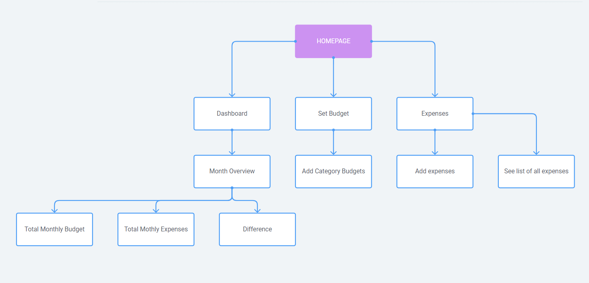

# myChange

## About
This app allows for users to track monthly expenses and set individualized budgets for a variety of categories.

## Setup

### Dependencies

- Run `npm install` in project directory. This will install server-related dependencies such as `express`.
- `cd client` and run `npm install`. This will install client dependencies.

### Database Prep
- Access the MySQL interface in your terminal
- Create a new database called budget: `create database budget`
- Add a `.env` file to the project folder of this repository containing the MySQL authentication information for MySQL user. For example:

```bash
  DB_HOST=localhost
  DB_USER=root
  DB_NAME=budget
  DB_PASS=YOURPASSWORD
```

- Run `npm run migrate` in the project folder of this repository, in a new terminal window. This will create the tables used in this database.

### Development

- Run `npm start` in project directory to start the Express server.
- In another terminal, do `cd client` and run `npm start` to start the client. 

## DatabaseSchema


## User flow diagram



## Possible Future Extensions
- Login page for multiple users
- Tracking individual expenses for each category, with category totals
- User can add their own category
- Goals page, saving up for a future trip or to buy a house, etc.


_This is a student project that was created at [CodeOp](http://codeop.tech), a full stack development bootcamp in Barcelona._